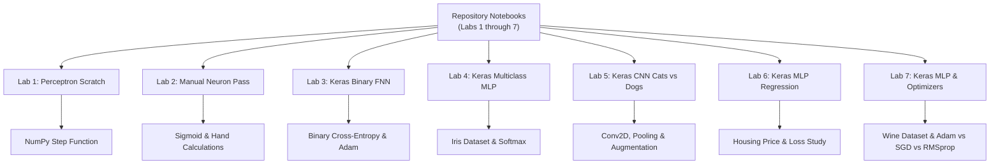

# Artificial Neural Networks (ANN) & Deep Learning Lab

## Conceptual Reference Guide: Labs 1 through 7

This repository contains Jupyter Notebooks that guide you through building, training, evaluating, and understanding artificial neural networks and deep learning models. We start with a basic Perceptron built from scratch, move to a single neuron with a smooth activation function, build a binary Feedforward Neural Network using TensorFlow/Keras, perform multi-class classification on tabular data, scale to Convolutional Neural Networks (CNNs) for image classification, and experiment with regression MLPs and optimizer comparisons.

- **Lab 1 Notebook**: [ANN_lab1.ipynb](./ANN_lab1.ipynb) — Perceptron from scratch using NumPy (AND Gate).
- **Lab 2 Notebook**: [ANN_lab2.ipynb](./ANN_lab2.ipynb) — Single neuron forward pass with Sigmoid activation (AND Gate).
- **Lab 3 Notebook**: [ANN_lab3.ipynb](./ANN_lab3.ipynb) — Multi-Layer Perceptron using TensorFlow/Keras (Binary AND Gate).
- **Lab 4 Notebook**: [ANN_lab4.ipynb](./ANN_lab4.ipynb) — Keras MLP for Multiclass Classification (Iris Dataset).
- **Lab 5 Notebook**: [ANN_lab5.ipynb](./ANN_lab5.ipynb) — CNN for Binary Image Classification (Cats vs. Dogs).
- **Lab 6 Notebook**: [ANN_lab6.ipynb](./ANN_lab6.ipynb) — Keras MLP for Regression (California Housing Dataset).
- **Lab 7 Notebook**: [ANN_lab7.ipynb](./ANN_lab7.ipynb) — Keras MLP for Multiclass Classification & Optimizer Comparison (Wine Dataset).

> [!NOTE]
> For a very simple version with stories and analogies, check out the [Explaination Guide](./explaination.md).

---

## 📌 Table of Contents

1. [Notebook Overview](#-notebook-overview)
2. [Lab 1: Perceptron from Scratch (NumPy)](#-lab-1-perceptron-from-scratch-numpy)
   - [Conceptual Foundations](#lab-1-conceptual-foundations)
   - [How It Learns](#lab-1-how-it-learns)
   - [Code Breakdown](#lab-1-code-breakdown)
3. [Lab 2: Single Neuron Forward Pass (Sigmoid)](#-lab-2-single-neuron-forward-pass-sigmoid)
   - [Conceptual Foundations](#lab-2-conceptual-foundations)
   - [Step-by-Step Hand Calculations](#lab-2-step-by-step-hand-calculations)
   - [Code Breakdown](#lab-2-code-breakdown)
4. [Lab 3: Feedforward Neural Network (TensorFlow/Keras)](#-lab-3-feedforward-neural-network-tensorflowkeras)
   - [Conceptual Foundations](#lab-3-conceptual-foundations)
   - [Layers & Trainable Parameters](#lab-3-layers--trainable-parameters)
   - [Loss & Optimizers Made Simple](#lab-3-loss--optimizers-made-simple)
   - [Code Breakdown](#lab-3-code-breakdown)
5. [Lab 4: Keras MLP for Multiclass Classification (Iris)](#-lab-4-keras-mlp-for-multiclass-classification-iris)
   - [Conceptual Foundations](#lab-4-conceptual-foundations)
   - [Layers & Trainable Parameters](#lab-4-layers--trainable-parameters)
   - [Loss & Activation Functions Made Simple](#lab-4-loss--activation-functions-made-simple)
   - [Code Breakdown](#lab-4-code-breakdown)
6. [Lab 5: CNN for Binary Image Classification (Cats vs. Dogs)](#-lab-5-cnn-for-binary-image-classification-cats-vs-dogs)
   - [Conceptual Foundations](#lab-5-conceptual-foundations)
   - [Convolution & Pooling Parameter Calculations](#lab-5-convolution--pooling-parameter-calculations)
   - [Data Augmentation & Regularization](#lab-5-data-augmentation--regularization)
   - [Code Breakdown](#lab-5-code-breakdown)
7. [Lab 6: Keras MLP for Regression (California Housing)](#-lab-6-keras-mlp-for-regression-california-housing)
   - [Conceptual Foundations](#lab-6-conceptual-foundations)
   - [Activation & Loss Function Experiments](#lab-6-activation--loss-function-experiments)
   - [Regression Evaluation Metrics](#lab-6-regression-evaluation-metrics)
   - [Code Breakdown](#lab-6-code-breakdown)
8. [Lab 7: Keras MLP for Multiclass Classification & Optimizers (Wine)](#-lab-7-keras-mlp-for-multiclass-classification--optimizers-wine)
   - [Conceptual Foundations](#lab-7-conceptual-foundations)
   - [Optimizer Comparison (Adam vs SGD vs RMSprop)](#lab-7-optimizer-comparison-adam-vs-sgd-vs-rmsprop)
   - [Evaluation & Confusion Matrices](#lab-7-evaluation--confusion-matrices)
   - [Code Breakdown](#lab-7-code-breakdown)
9. [🎓 The Viva Q&A Guide (45+ Conceptual Questions)](#-the-viva-qa-guide-45-conceptual-questions)

---

## 🗺️ Notebook Overview

The seven labs show the complete progression of neural network concepts from basic linear classifiers to deep CNNs and multi-experiment MLPs:



---

## 🧠 Lab 1: Perceptron from Scratch (NumPy)

### Lab 1: Conceptual Foundations

A **Perceptron** is the simplest form of a neural network, introduced by Frank Rosenblatt in 1958. It is a **linear classifier**, meaning it separates data using a single straight line.

- **Inputs**: The data coordinates or features (for the AND gate, these are two binary inputs: `0` or `1`).
- **Weights**: The importance or strength given to each input.
- **Bias**: The threshold or "natural grumpiness" of the neuron. It decides how easy or hard it is for the neuron to activate.
- **Step Activation Function**: A sharp ON/OFF switch. If the net score (inputs multiplied by weights, plus bias) is 0 or positive, it outputs `1`. If the score is negative, it outputs `0`.

**Limitation**: A Perceptron can only solve problems that are **linearly separable** (where a single straight line can separate the two classes). Logical AND, OR, and NAND gates can be separated by a line. Logical XOR and XNOR gates cannot, so a single Perceptron fails to solve them.

### Lab 1: How It Learns

1. **Weighted Sum**: The Perceptron multiplies each input by its weight and adds the bias to get a single score.
2. **Activation**: The score is passed through the ON/OFF Step function to get a predicted class (`0` or `1`).
3. **Weight Update Rule**: If the prediction is wrong, we calculate the error (`target - prediction`). We then adjust the weights and bias by a small step size called the **learning rate** (often written as `0.1` or `0.01`). If the prediction is correct, no changes are made.

### Lab 1: Code Breakdown

- **Step Function**:
  ```python
  def step_function(x):
      if x >= 0:
          return 1
      return 0
  ```

- **Constructor (`__init__`)**:
  ```python
  def __init__(self, input_size, learning_rate=0.1):
      self.weights = np.zeros(input_size)
      self.bias = 0
      self.learning_rate = learning_rate
  ```

- **Prediction (`predict`)**:
  ```python
  def predict(self, x):
      total = np.dot(x, self.weights) + self.bias
      return step_function(total)
  ```

- **Training (`train`)**:
  ```python
  def train(self, X, y, epochs=10):
      for _ in range(epochs):
          for inputs, target in zip(X, y):
              prediction = self.predict(inputs)
              error = target - prediction
              self.weights += self.learning_rate * error * inputs
              self.bias += self.learning_rate * error
  ```

---

## 🔢 Lab 2: Single Neuron Forward Pass (Sigmoid)

### Lab 2: Conceptual Foundations

This lab demonstrates **forward propagation** (how data flows forward through a network) using fixed settings. Instead of training the neuron, we hardcode the weights and bias to show how the math works.

- **Sigmoid Activation**: A smooth "dimmer switch" instead of a sharp ON/OFF step function. It outputs a decimal value between `0` and `1`. This output represents the probability or confidence of the classification (e.g., `0.57` means "57% confident the answer is 1").
- **Thresholding**: To make a final binary prediction, we check if the sigmoid output is `0.5` or higher. If it is, we classify it as `1`; otherwise, it is `0`.

### Lab 2: Step-by-Step Hand Calculations

Using these fixed parameters from the lab:
- Weights: `[0.5, 0.5]`
- Bias: `-0.7`

| Input (x1, x2) | Weighted Sum (z) | Sigmoid Formula Output | Final Prediction (Is Output >= 0.5?) |
| :--- | :--- | :--- | :--- |
| **[0, 0]** | (0 * 0.5) + (0 * 0.5) - 0.7 = -0.7 | 1 / (1 + e^0.7) = 0.3318 | **0** (since 0.3318 < 0.5) |
| **[0, 1]** | (0 * 0.5) + (1 * 0.5) - 0.7 = -0.2 | 1 / (1 + e^0.2) = 0.4502 | **0** (since 0.4502 < 0.5) |
| **[1, 0]** | (1 * 0.5) + (0 * 0.5) - 0.7 = -0.2 | 1 / (1 + e^0.2) = 0.4502 | **0** (since 0.4502 < 0.5) |
| **[1, 1]** | (1 * 0.5) + (1 * 0.5) - 0.7 = 0.3 | 1 / (1 + e^-0.3) = 0.5744 | **1** (since 0.5744 >= 0.5) |

---

## ⚡ Lab 3: Feedforward Neural Network (TensorFlow/Keras)

### Lab 3: Conceptual Foundations

This lab uses **TensorFlow and Keras** to build a complete Multi-Layer Perceptron (MLP). Rather than a single neuron, we stack multiple neurons together to form a full network.

- **Input Layer**: Where the input signals enter.
- **Hidden Layer**: A middle layer of neurons that allows the network to learn non-linear relationships.
- **Output Layer**: The final layer that produces the prediction.
- **Backpropagation**: The training algorithm. When the network makes a mistake, it calculates error gradients and updates weights backward through the layers.

### Lab 3: Layers & Trainable Parameters

```
       [Input 1] -------\      /---> [Hidden Neuron 1 (ReLU)] ---\
                         \    /----> [Hidden Neuron 2 (ReLU)] ----\
                          \  /-----> [Hidden Neuron 3 (ReLU)] -----\
       [Input 2] ----------X-------> [Hidden Neuron 4 (ReLU)] ------+---> [Output (Sigmoid)]
```

#### Trainable Parameters Calculation:
* **Input Layer to Hidden Layer**: $2 \times 4 + 4 = 12$ parameters.
* **Hidden Layer to Output Layer**: $4 \times 1 + 1 = 5$ parameters.
* **Total Parameters**: $12 + 5 = 17$ trainable parameters.

---

## 🌸 Lab 4: Keras MLP for Multiclass Classification (Iris)

### Lab 4: Conceptual Foundations

In contrast to binary classification (where the target is 0 or 1), **Multiclass Classification** involves classifying inputs into one of three or more distinct categories.

In Lab 4, we use the **Iris Dataset** (150 samples, 4 features) to classify flowers into **3 species**:
1. `0`: Setosa
2. `1`: Versicolor
3. `2`: Virginica

### Lab 4: Layers & Trainable Parameters

```
    [4 Features] =====> [Hidden Layer: 8 Neurons (ReLU)] =====> [Output Layer: 3 Neurons (Softmax)]
```

#### Trainable Parameters Calculation:
* **Input Layer to Hidden Layer**: $4 \times 8 + 8 = 40$ parameters.
* **Hidden Layer to Output Layer**: $8 \times 3 + 3 = 27$ parameters.
* **Total Parameters**: $40 + 27 = 67$ trainable parameters.

---

## 🐱🐶 Lab 5: CNN for Binary Image Classification (Cats vs. Dogs)

### Lab 5: Conceptual Foundations

Convolutional Neural Networks (CNNs) are specialized deep learning architectures designed for grid-structured inputs like images. Unlike flat MLPs, CNNs preserve 2D spatial hierarchy using local receptive fields and shared weights.

Key Architectural Components:
1. **Convolutional Layer (`Conv2D`)**: Slides spatial filters ($3 \times 3$) across the input image to compute dot products, extracting feature maps (edges, textures, shapes).
2. **Pooling Layer (`MaxPooling2D`)**: Reduces spatial dimensions ($2 \times 2$) by retaining only maximum activations, providing translation invariance and computational efficiency.
3. **Data Augmentation (`RandomFlip`, `RandomRotation`, `RandomZoom`)**: Artificially expands training data variability to prevent overfitting on small datasets.
4. **Dropout (`Dropout(0.5)`)**: Randomly deactivates $50\%$ of neurons during training passes, preventing co-adaptation of feature detectors.
5. **Dense Output Head**: Flattens spatial feature maps and passes them through a fully connected dense layer before a single **Sigmoid** output neuron.

### Lab 5: Convolution & Pooling Parameter Calculations

Input Image Shape: $(150, 150, 3)$

Formula for output dimension of Conv2D:
$$O = \frac{W - F + 2P}{S} + 1$$
Where $W$ is input width/height, $F$ is filter size, $P$ is padding, and $S$ is stride.

| Layer | Type | Output Shape | Param Calculation | Total Params |
| :--- | :--- | :--- | :--- | :--- |
| **Input** | InputLayer | `(150, 150, 3)` | — | `0` |
| **Conv2D_1** | Conv2D (32 filters, 3x3) | `(148, 148, 32)` | $(3 \times 3 \times 3 + 1) \times 32$ | `896` |
| **MaxPool_1**| MaxPooling2D (2x2) | `(74, 74, 32)` | — | `0` |
| **Conv2D_2** | Conv2D (64 filters, 3x3) | `(72, 72, 64)` | $(3 \times 3 \times 32 + 1) \times 64$ | `18,496` |
| **MaxPool_2**| MaxPooling2D (2x2) | `(36, 36, 64)` | — | `0` |
| **Conv2D_3** | Conv2D (128 filters, 3x3)| `(34, 34, 128)` | $(3 \times 3 \times 64 + 1) \times 128$ | `73,856` |
| **MaxPool_3**| MaxPooling2D (2x2) | `(17, 17, 128)` | — | `0` |
| **Conv2D_4** | Conv2D (128 filters, 3x3)| `(15, 15, 128)` | $(3 \times 3 \times 128 + 1) \times 128$ | `147,584` |
| **MaxPool_4**| MaxPooling2D (2x2) | `(7, 7, 128)` | — | `0` |
| **Flatten** | Flatten | `(6272)` | $7 \times 7 \times 128$ | `0` |
| **Dropout** | Dropout(0.5) | `(6272)` | — | `0` |
| **Dense_1** | Dense (512, ReLU) | `(512)` | $(6272 + 1) \times 512$ | `3,211,776` |
| **Output** | Dense (1, Sigmoid) | `(1)` | $(512 + 1) \times 1$ | `513` |
| **Total** | | | | **3,453,121** |

---

## 🏠 Lab 6: Keras MLP for Regression (California Housing)

### Lab 6: Conceptual Foundations

Regression models predict continuous numeric target variables rather than discrete class labels. In Lab 6, we predict `MedHouseVal` (median house values in units of \$100,000) using 8 census features from the California Housing dataset (20,640 samples).

Key Differences from Classification:
- **Output Layer**: Uses a single neuron with **linear activation** ($\hat{y} = z$), allowing predictions across an unbounded continuous spectrum.
- **Preprocessing**: `StandardScaler` scales input features while keeping target values in native dollar units for direct metric interpretability.
- **Loss Functions**: Evaluated across 3 distinct functions:
  1. **MSE (Mean Squared Error)**: $L = \frac{1}{n} \sum (y - \hat{y})^2$ — penalizes large errors quadratically.
  2. **MAE (Mean Absolute Error)**: $L = \frac{1}{n} \sum |y - \hat{y}|$ — robust to target outliers.
  3. **Huber Loss**: Piecewise loss combining quadratic MSE for small errors ($|y - \hat{y}| \le \delta$) with linear MAE for large outliers.

### Lab 6: Activation & Loss Function Experiments

Architecture: `8 Inputs → Dense(64) → Dense(32) → Dense(1, Linear)`

| Experiment | Activation | Loss Function | Key Finding / Behavior |
| :--- | :--- | :--- | :--- |
| **Model 1** | `ReLU` | `MSE` | Fast convergence, standard baseline. |
| **Model 2** | `Sigmoid` | `MSE` | Slower convergence due to vanishing gradients. |
| **Model 3** | `Tanh` | `MSE` | Zero-centered outputs improve gradient flow over Sigmoid. |
| **Model 4** | `ReLU` | `MAE` | Linear error weighting, resistant to top-coded outliers. |
| **Model 5** | `ReLU` | `Huber` | **Best overall**: combines smooth convergence with outlier robustness. |

---

## 🍷 Lab 7: Keras MLP for Multiclass Classification & Optimizers (Wine)

### Lab 7: Conceptual Foundations

Lab 7 classifies wine samples into 3 cultivars based on 13 chemical features from the UCI Wine dataset (178 samples).

Key Design Elements:
- **Stratified Train/Test Split**: Ensures that each class (59 / 71 / 48 samples) is equally represented in both train ($80\%$) and test ($20\%$) sets.
- **One-Hot Target Encoding**: Converts target integers `0, 1, 2` into 3D one-hot vectors for Softmax categorical cross-entropy optimization.
- **Optimizer Comparison**: Sweeps across 3 core optimization algorithms:
  1. **Adam**: Adaptive Moment Estimation (combines momentum and RMSprop per-parameter step scaling).
  2. **SGD**: Stochastic Gradient Descent with fixed learning rate.
  3. **RMSprop**: Root Mean Squared Propagation (adapts learning rate based on recent gradient magnitudes).

### Lab 7: Optimizer Comparison

Architecture: `13 Inputs → Dense(32) → Dense(16) → Dense(3, Softmax)`

| Model | Activation | Optimizer | Convergence Speed | Macro F1 Score | Notes |
| :--- | :--- | :--- | :--- | :--- | :--- |
| **Model 1** | `ReLU` | `Adam` | **Fastest** | **Highest (~0.97+)** | Best balanced optimizer; fast & stable. |
| **Model 2** | `Sigmoid` | `Adam` | Moderate | ~0.90 | Slower initial learning rate. |
| **Model 3** | `Tanh` | `Adam` | Fast | ~0.95 | Strong performance, slightly behind ReLU. |
| **Model 4** | `ReLU` | `SGD` | Slowest | ~0.85 | Requires more epochs or momentum. |
| **Model 5** | `ReLU` | `RMSprop` | Fast | ~0.96 | Highly competitive with Adam. |

---

## 🎓 The Viva Q&A Guide (45+ Conceptual Questions)

### Q1: What is the main objective of these seven labs?
**Answer:** They demonstrate the full progression of neural networks:
1. **Lab 1**: Single Perceptron from scratch (NumPy).
2. **Lab 2**: Single neuron forward pass with Sigmoid.
3. **Lab 3**: Binary Feedforward Neural Network (TensorFlow/Keras).
4. **Lab 4**: Multiclass MLP Classification (Iris Dataset).
5. **Lab 5**: Convolutional Neural Networks (CNNs) for Binary Image Classification.
6. **Lab 6**: Regression MLPs & Loss Function Analysis (California Housing).
7. **Lab 7**: Multiclass Classification & Optimizer Comparison (Wine Dataset).

### Q2: What is a Perceptron, and who introduced it?
**Answer:** A Perceptron is the earliest linear binary classifier, introduced by Frank Rosenblatt in 1958. It computes a weighted sum of inputs, adds bias, and passes the score through a Step activation function.

### Q3: What is the purpose of bias ($b$)?
**Answer:** Bias provides trainable offset to shifting the activation function along the axis, allowing decision boundaries that do not pass through the origin $(0,0)$.

### Q4: Why can a Perceptron solve AND but not XOR?
**Answer:** AND is linearly separable (separable by a single straight line). XOR is non-linearly separable (diagonal target distribution).

### Q5: Why is zero weight initialization unsuitable for deep networks?
**Answer:** If all weights are initialized to zero, all neurons in a layer compute identical gradients and updates, resulting in symmetry where neurons fail to learn distinct feature detectors.

### Q6: What is the learning rate ($\eta$)?
**Answer:** A hyperparameter controlling step size along the negative gradient vector during weight updates.

### Q7: Compare Step, Sigmoid, ReLU, and Softmax activation functions.
**Answer:**
- **Step**: Discontinuous binary switch; zero derivative everywhere.
- **Sigmoid**: Smooth S-curve $(0,1)$; ideal for binary outputs.
- **ReLU**: $\max(0, x)$; computationally efficient for hidden layers.
- **Softmax**: Converts a vector of $K$ logits into normalized probabilities summing to $1.0$.

### Q8: What is the vanishing gradient problem?
**Answer:** In deep architectures, backpropagating gradients through multiple Sigmoid/Tanh layers multiplies fraction values ($<0.25$), causing early-layer gradients to shrink to near-zero.

### Q9: Why is Binary Cross-Entropy preferred over MSE for binary classification?
**Answer:** BCE provides steep logarithmic gradients for incorrect confident predictions, accelerating convergence, whereas MSE produces flat gradient regions when paired with Sigmoid.

### Q10: How does the Adam optimizer work?
**Answer:** Adam (Adaptive Moment Estimation) tracks exponentially decaying averages of past gradients (momentum) and squared past gradients (RMSprop) to adapt individual learning rates per parameter.

### Q11: What is One-Hot Encoding?
**Answer:** Representation of categorical targets as binary vectors where only the true class index contains $1$ and others $0$.

### Q12: Compare `categorical_crossentropy` vs `sparse_categorical_crossentropy`.
**Answer:**
- `categorical_crossentropy`: Expects target labels as One-Hot Encoded vectors (`[0, 1, 0]`).
- `sparse_categorical_crossentropy`: Expects target labels as raw integers (`1`).

### Q13: What is a Convolutional Layer (`Conv2D`)?
**Answer:** A layer that applies spatial filter kernels across 2D inputs to extract feature maps representing edges, textures, and visual patterns.

### Q14: How is Conv2D output spatial size calculated?
**Answer:** $O = \frac{W - F + 2P}{S} + 1$, where $W$ is input size, $F$ filter size, $P$ padding, and $S$ stride.

### Q15: What is the role of MaxPooling2D?
**Answer:** Downsamples feature maps by taking the maximum value in spatial windows ($2 \times 2$), reducing dimensionality and providing translation invariance.

### Q16: How many trainable parameters are in a Conv2D layer with 32 filters of size $3 \times 3$ on 3-channel input?
**Answer:** $(3 \times 3 \times 3 + 1) \times 32 = (27 + 1) \times 32 = 896$ parameters.

### Q17: What is Data Augmentation in CNNs?
**Answer:** Applying random spatial transformations (flips, rotations, zooms) to training images to expand dataset diversity and prevent overfitting.

### Q18: What is Dropout and how does it function during training vs inference?
**Answer:**
- **Training**: Randomly zeroes out a set fraction of neuron outputs (e.g. $50\%$) per step to break co-adaptation.
- **Inference**: All neurons are active, with outputs scaled by $(1 - p)$.

### Q19: What is Regression in deep learning?
**Answer:** Supervised learning tasks where the network predicts continuous numerical values rather than discrete class categories.

### Q20: Why does the output layer of a regression MLP use a linear activation?
**Answer:** Linear activation ($\hat{y} = z$) places no bounds on output values, allowing predictions across positive, negative, and infinite continuous ranges.

### Q21: Compare MSE, MAE, and Huber loss functions.
**Answer:**
- **MSE**: Squares errors; sensitive to outliers.
- **MAE**: Absolute errors; robust to outliers but non-differentiable at 0.
- **Huber**: Quadratic (MSE) for small errors ($|e| \le \delta$), linear (MAE) for large errors.

### Q22: What is the $R^2$ Score (Coefficient of Determination)?
**Answer:** A metric measuring the proportion of variance in the target variable explained by the regression model ($1.0$ is perfect fit, $0.0$ equals baseline mean predictor).

### Q23: What is RMSE and why is it preferred over MSE for interpretation?
**Answer:** Root Mean Squared Error ($\text{RMSE} = \sqrt{\text{MSE}}$) brings error units back into the same scale as the target variable.

### Q24: What is a Stratified Train/Test Split?
**Answer:** Splitting data such that class distributions in training and testing subsets exactly mirror the full dataset proportion.

### Q25: Compare Adam, SGD, and RMSprop optimizers.
**Answer:**
- **Adam**: Adaptive per-parameter learning rate with momentum.
- **SGD**: Fixed step updates along raw gradient; can oscillate.
- **RMSprop**: Scales learning rate by moving average of squared gradients.

### Q26: What is a Confusion Matrix?
**Answer:** An $N \times N$ cross-tabulation table comparing true class labels against predicted class labels to highlight misclassification patterns.

### Q27: Compare Macro-averaged vs Micro-averaged F1 Score.
**Answer:**
- **Macro-average**: Calculates F1 per class independently and averages them (treats all classes equally).
- **Micro-average**: Aggregates global true positives, false positives, and false negatives (weighted by sample counts).

### Q28: Why is Feature Scaling (`StandardScaler`) essential for MLPs?
**Answer:** Prevents input features with large raw scales from dominating gradient updates and causing numeric instability.

### Q29: What is Early Stopping?
**Answer:** Monitoring validation loss during training and terminating epochs early when validation performance ceases to improve.

### Q30: What is an epoch vs batch vs iteration?
**Answer:**
- **Epoch**: One complete pass through the entire dataset.
- **Batch**: Chunk of samples evaluated in a single forward/backward pass.
- **Iteration**: One single weight update step.

### Q31: What is Backpropagation calculus based on?
**Answer:** The **Chain Rule** of differential calculus.

### Q32: What is gradient descent?
**Answer:** Iterative optimization algorithm that adjusts parameters in direction of steepest descent ($-\nabla L$).

### Q33: Why do we use ReLU in hidden layers?
**Answer:** Avoids vanishing gradients for positive inputs and is computationally fast ($\max(0,x)$).

### Q34: What is co-adaptation of neurons?
**Answer:** When network neurons depend heavily on specific other neurons to fix errors, leading to brittle memorization.

### Q35: What is translation invariance in CNNs?
**Answer:** Ability of CNNs to recognize features regardless of where they appear in an image, facilitated by pooling.

### Q36: What is a logit?
**Answer:** Unnormalized raw output score generated by a neural network layer before activation.

### Q37: Why do we fit `StandardScaler` ONLY on training data?
**Answer:** To prevent data leakage from the validation/test sets into preprocessing parameters.

### Q38: What is underfitting?
**Answer:** When a model fails to learn underlying patterns in training data, exhibiting high training and validation loss.

### Q39: What is overfitting?
**Answer:** When a model memorizes noise in training data, producing low training loss but high validation loss.

### Q40: What is the role of `tf.data.AUTOTUNE`?
**Answer:** Dynamically tunes pipeline prefetching and processing threads to optimize CPU/GPU utilization.

### Q41: Why use `.cache()` in TensorFlow data pipelines?
**Answer:** Saves preprocessed images in memory after first epoch to avoid repeated disk reads.

### Q42: What is binary cross-entropy loss formula?
**Answer:** $L = - [y \log(\hat{y}) + (1-y) \log(1-\hat{y})]$.

### Q43: What is categorical cross-entropy loss formula?
**Answer:** $L = -\sum_{i=1}^{K} y_i \log(\hat{y}_i)$.

### Q44: What is the purpose of `np.argmax()`?
**Answer:** Returns the index of the highest probability value in an array to determine predicted class label.

### Q45: What is the relationship between model capacity and dataset size?
**Answer:** High capacity models on small datasets tend to overfit without regularization; low capacity models on large datasets underfit.
